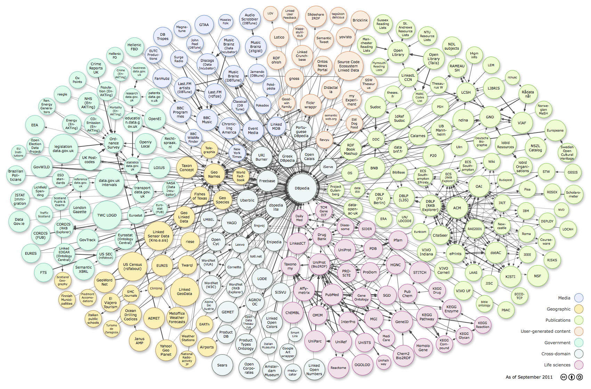

# Introduktion till länkade data (LD)
//TODO Matthias issue 15
1990 skapade Tim Berners-Lee grunden för World Wide Web genom att kombinera principerna bakom internet med hypertext. 
I korthet introducerade han principer för att identifiera (URL:er), publicera (HTML) och hämta (HTTP) dokument. 
16 år senare lanserar Tim Berners-Lee *Länkade Data* som ett sätt att skapa en *web av data* i en 
[design issue](http://www.w3.org/DesignIssues/LinkedData.html). 
Skillnaden mot den vanliga webben är att länkade data handlar om att länka samman ting och beskrivningar om ting snarare än dokument.  

På sista tiden har också intresset för det som kallas *öppna data* växt kraftigt, vilket innebär att man gör sin data
tillgängliga för att förenkla användning, såväl väntad som oväntad. I praktiken innebär det att data görs tillgänglig via 
webben i någon form då det är det dominanerade mediet.

Det är intressant att notera att syftet med öppna data är vällovliga, men saknar den potential som länkad data innefattar. Lite slagkraftigt kan man formulera det så här:

    Öppna data är som webben utan enhetligt format eller länkar.

Man kan också se det som att länkade öppna data är en utvidgning till öppna data:
 
    Länkade öppna data är öppna data med enhetligt format (RDF) och länkar.  
 
Den nogranne har här säkert noterat att det ovan smygit sig in ett öppna i länkade data. 
Skillnaden handlar bara i vilken omfattning datan är åtkomlig för en större publik. 
Men det finns fördelar att använda länkade data även om den inte är allmänt tillgänglig (öppen), 
därför kommer vi oftast att tala om länkade data snarare än länkade öppna data. 

## LD på 1 minut
//TODO Matthias issue 12
//Nedan är vad och varför, lägg till hur och dela upp i rubriker, typ: Vad är Länkade Data. Varför ska jag publicera Länkade Data...

Länkade data handlar om att komplettera den existerande webben av dokument med en *webb av data*.
Följande tre principer är mer konkreta i hur det går till:

* enhetlig informationsmodell - data som påståenden om ting (andvänd *RDF*)
* addresserbarhet - varje ting har en webbaddress där dess påståenden kan hämtas (använd *URI:er* och *HTTP*)
* länka ihop - förbind ting med varandra genom *relationer* av olika slag

Dessa principer innebär:

* lättare att förstå och återanvända varandras data
* specialisera data genom att identifiera och länka till data som redan finns och fokusera på specifika och unika mervärden
* data blir bättre tillgänglig på webben och i sökmotorer
* tekniker för kunskapshantering blir lättare att använda

## Webben och länkade data

Webben av idag har stor spridning och är i många fall det gemensamma kitt som binder samman aktörer över kulturella och språkliga gränser. Webben används ofta till både spridning och inhämtning av information samt till att bygga mer avancerade webbapplikationer. Trots denna vida användning är webben i grunden tämligen enkel och dess tekniska beståndsdelar innefattar i huvudsak:

* URI - ett enhetligt sätt att addressera olika informationsresurser (ofta webbsidor)
* HTTP - ett protokoll som används för att hämta och skicka information
* HTML - ett format för att presentera och interagera med information
* Länkar - ett sätt att binda samman informationsresurser

Webben är trots sina vida användningsområden i huvudsak ett presentationsmedium för människor. Det innebär att webben, och framförallt HTML, oftast inte lämpar sig för att utbyta information mellan system.

För att utbyta information mellan system är istället det snarlika initiativet *Länkade data* ett bättre alternativ. Precis som webben bygger länkade data på användning av URI:er och HTTP, men istället för HTML används *RDF*. I korthet kan man säga att RDF används för att uttrycka *påståenden* om *ting*, där ting är vad som helst som kan identifieras av en URI. Det är alltså inte bara webbsidor som identifieras av URI:er (webbaddresser) utan även fysiska föremål, historiska händelser, abstrakta begrepp osv. Det vill säga, vi kan ge URI:er även till ting som inte har en given digital representation. Sammanfattningsvis, länkade data innefattar i huvudsak följande tekniska beståndsdelar:

* URI - ett enhetligt sätt att addressera *ting*
* HTTP - ett protokoll som används för att hämta *påståenden* om ting via deras URI:er
* RDF - ett språk för att uttrycka påståenden om ting
* länkar - påståenden om relationer mellan ting

Bilden nedan visar en jämförelse mellan webben och länkade data:

## Stjärnmodellen

I samband med öppna data och länkade öppna data använder man ofta en femstjärnig skala för att markera hur tillgänglig datan är:

★★★★★ gör din information tillgänglig på webben under en öppen licens 
★★★★★ (även svårbearbetade format som skannade dokument är ok) 
★★★★★ gör informationen tillgänglig som strukturerad data 
★★★★★ (t. ex., Excel format istället för en bild av en tabell) 
★★★★★ använd icke-proprietära format 
★★★★★ (t. ex., CSV istället för Excel) 
★★★★★ använd URI:er för att identifiera ting, 
★★★★★ och RDF för att uttrycka påståenden om dem 
★★★★★ länka dina data till andras data, det ger sammanhang

Nedan beskrivs fördelar med stjärnnivåerna, notera att fördelar ackumuleras ju fler stjärnor man når.

### ★ En stjärna - data tillgängligt digitalt

Om du lägger ut din data så att den är digitalt tillgänglig och det är tydligt att folk får använda datan
(i form av en licens) så får du alltid en stjärna.
Till exempel, om man redan har information tillgänglig på vanliga webbsidor och kompletterar hur informationen
får vidareanvändas är första stjärnan säkrad.

Det är ett stort steg att gå från att behöva explicit begära data från en organisation till att informationen
finns tillgänglig digitalt.

### ★★ Två stjärnor - öka datakvalitén

Att dela ut ett format där data är tillgängligt på ett maskinprocessbart sätt utan att man behöver
använda någon form av riskfylld extraheringsprocess gör att andra kan förlita sig på datan i större utsträckning.
Insatsen för att använda datan i andra sammanhang har sjunkit betydligt och två stjärnor är säkrade.

### ★★★ Tre stjärnor - öppna data

Med tre stjärnor minskar man behovet av investeringar i proprietär teknologi hos de som vidareutnyttjar datan.
Då man förlitar sig på öppna format som antingen är väldigt enkla (t ex CSV formatet) eller väl dokumenterade
skapar man förutsättningar för mer långsiktig hållbar data.
Man minskar även risken för felaktig bearbetning av information när proprietära format hanteras av tredje parts
mjukvara (särskilt när fullständig dokumentation om formatet saknas).

### ★★★★ Fyra stjärnor - enhetligt informationsuttryck och tydlig semantik

Med den fjärde stjärnan uppnås flera saker:

* Genom att man delat upp datan i ting som har globala identifierare, URI:er, möjliggör man för andra att
referera till den egna datan på ett sätt som är standardiserat och effektivt.
* Dataintegration med andra parter förenklas då det datauttryck man väljer inte är bundet till det egna datalagret.
Istället beskriver man sin data med hjälp av existerande termer, ofta anpassar och kombinera man en eller
flera existerande informationsmodeller efter egna behov. Detta innebär att när den egna datan ska vidareutnyttjas
kan andra parter redan ha kännedom eller till och med utvecklat stöd för att förstå delar av informationsmodellen.
* Den informationsmodell man utvecklat är med stor sannolikhet mer genomtänkt då den är en
vidareutveckling av tidigare informationsmodeller.
* Då datan uttrycks med RDF, ett standardiserat språk för hantera information så finns redan många
mjukvarubibliotek och tjänster som kan användas för att skapa, validera, lagra, maskinellt bearbeta,
kombinera, redigera och utforska datan med existerande frågespråk.

### ★★★★★ Fem stjärnor - länkade öppna data

Den femte stjärnan ger flera ytterligare fördelar:

* Förtydliga din data genom att länka till väletablerade och väl uttänkta termer/begrepp
istället för att skapa egna eller skriva fritext.
* Använd data/begrepp/termer från andra datakällor direkt när behov uppstår utan att först behöva fokusera
på tekniska aspekter av dataintegration som import, konvertering och drift/underhåll.
* Effektiv använd länkning kan leda till att öka dataspecialisering då du kan fokusera på att underhålla de
delar av datan som är unik för din organisation och mindre med information som redan finns i andra datakällor.
* Länkar till andra datakällor ökar förtroendet för att din data är genomtänkt på ungefär
på samma sätt som referenser i artiklar visar på att informationen är förankrad i ett större sammanhang.
* Länkar ut ökar din datas synlighet då det blir en del av det större länkade data molnet vilket i ett
längre perspektiv kan leda till återanvändning i nya sammanhang, dvs i form av länkar in.

## Vikten av återanvändning
//TODO Hannes issue 11

## Länkade data - en global rörelse

Länkade data introducerades av Webbens grundare sir Tim Berners-Lee 2006 i en inflytelserik [Linked Data Design Note](http://www.w3.org/DesignIssues/LinkedData.html).
Ett sätt att mäta i vilken omfattning länkade data används är att se hur många dataset och hur många påståenden som publicerats
över tiden. Till exempel så ökade antalet publicerade påståenden från 2 miljarder 2007 till 30 miljarder 2011.
Antalet dataset har också ökat dramatiskt vilket kan ses i de visualiseringar som gjordes av det så kallade [LOD molnet](http://lod-cloud.net/).
Tyvär har ingen visualisering gjorts sedan 2011, då såg det ut så här:

“Linking Open Data cloud diagram, by Richard Cyganiak and Anja Jentzsch. http://lod-cloud.net/”

En indikation på att det fortsatt att växa sedan dess kan man få genom att söka fram alla dataset på [datahub.io](http://datahub.io/dataset?tags=lod), vid skrivande stund är de 898 stycken. Detta ska jämföras med de 295 som ingick i visualiseringen 2011. Det är också troligt att
det finns ett stort mörkertal med dataset som antingen inte registrerats alls eller registrerats i nationella register
som inte alltid aggregeras i datahub.io.

Innehållsmässigt spänner dataseten över de flesta områden till exempel, myndighetsdata, biomedicin, media, geografisk information osv.
